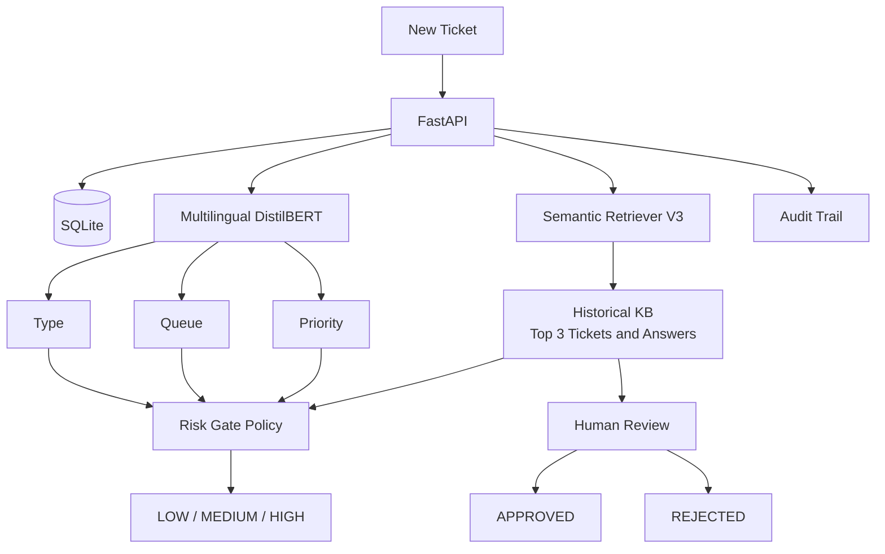
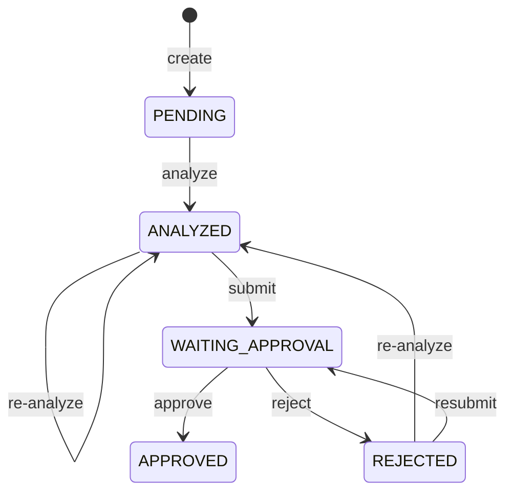

# AI Helpdesk Ticket Router

다국어 IT Helpdesk Ticket의 `subject + body`를 입력받아 **Ticket Type, Queue, Priority**를 분류하고 과거 해결 사례를 검색하는 FastAPI 시스템입니다. Ticket은 SQLite에 저장되며 담당자의 승인·반려와 상태 변경은 Audit Trail로 남습니다.

이 프로젝트의 핵심은 모델 하나를 학습한 것이 아니라, 실패한 V1 representation을 진단하고 semantic positive mining과 hard negative mining으로 개선한 뒤 별도 holdout으로 검증하고 Human-in-the-loop workflow에 연결한 과정입니다.

> **v1.0 범위:** Classification, V3 retrieval, Risk Gate, Ticket workflow, Human Approval, Audit Trail은 API에 연결되어 있습니다. Local Ollama LLM Draft는 Experimental입니다.

## 주요 기능

- Multilingual DistilBERT 기반 `type`, `queue`, `priority` 분류와 confidence
- Fine-tuned Semantic Retriever V3 기반 유사 Ticket·과거 Answer Top K 검색
- SQLite Ticket 관리, Human Approval, Audit Trail
- Validation data로 calibration한 retrieval risk policy
- Local Ollama 답변 초안(Experimental)

## Architecture



Ticket 분석 시 classification confidence와 Retrieval Top1 similarity를 Risk Gate에 전달해 risk를 저장합니다.

## Tech Stack

| 영역 | 기술 |
|---|---|
| Language / API | Python 3.12+, FastAPI, Uvicorn, Pydantic |
| ML | PyTorch, Transformers, Sentence Transformers, scikit-learn |
| Database / Data | SQLite, SQLAlchemy, Pandas, NumPy |
| Environment | uv, PyCharm, Windows, CUDA, RTX 3060 Laptop GPU 6GB |
| Classification base | `distilbert/distilbert-base-multilingual-cased` |
| Embedding base | `sentence-transformers/paraphrase-multilingual-MiniLM-L12-v2` |

## Dataset

Customer IT Support Ticket Dataset **28,587 rows**를 사용했습니다. 주요 컬럼은 `subject`, `body`, `answer`, `type`, `queue`, `priority`, `language`, `tag_1` ~ `tag_8`이며 입력은 `subject + body`, classification target은 `type`, `queue`, `priority`입니다.

Retrieval KB는 `data/processed/rag_train.csv`의 **22,864 tickets**입니다. KB와 평가 데이터를 분리해 leakage를 방지했습니다. V3 선택은 `v3_dev.csv`에서만 수행했고, **1,429건의 `final_holdout.csv`는 모델 선택 후 최종 평가에 한 번 사용했습니다.**

## Retriever 실험

| Model | Type@1 | Queue@1 | Priority@1 | Type@3 | Queue@3 | Priority@3 |
|---|---:|---:|---:|---:|---:|---:|
| TF-IDF | 90.94% | 74.39% | 78.66% | 97.34% | 83.07% | 90.69% |
| Pretrained Semantic | 92.06% | 80.16% | 83.73% | 97.62% | 87.61% | 93.18% |
| Hybrid RRF | 92.20% | 76.80% | 80.76% | 97.69% | 86.35% | 91.88% |
| Fine-tuning V1 | 90.69% | 73.30% | 77.29% | 97.52% | 84.22% | 90.87% |
| Fine-tuning V2 | 93.25% | 81.46% | 85.48% | 97.97% | 89.33% | 94.12% |

Pretrained Semantic Retriever는 `paraphrase-multilingual-MiniLM-L12-v2`입니다. TF-IDF + Semantic Retrieval을 Reciprocal Rank Fusion한 Hybrid는 Type이 소폭 향상됐지만 Queue/Priority가 하락해 채택하지 않았습니다.

V1은 같은 `queue + type` label을 positive로 만든 Triplet 학습입니다. Mean Top1 Similarity가 약 **0.9999**까지 상승했지만 실제 retrieval 성능은 하락해 embedding space를 진단했습니다.

## Representation Diagnosis

| Model | Random | Positive | Negative | P-N Gap | Effective Rank | Participation Ratio |
|---|---:|---:|---:|---:|---:|---:|
| Pretrained | 0.352034 | 0.931237 | 0.325517 | 0.605720 | 59.058331 | 22.580736 |
| V1 | 0.999376 | 0.999905 | 0.999262 | 0.000643 | 16.398256 | 4.131590 |
| V2 | 0.018926 | 0.853945 | -0.007516 | 0.861461 | 90.710678 | 47.113564 |
| V3 | 0.010647 | 0.827841 | -0.011079 | 0.838920 | 106.467979 | 62.341763 |

V1은 positive와 negative cosine similarity가 모두 1에 가깝고 P-N Gap이 **0.000643**까지 줄었으며 Effective Rank와 Participation Ratio도 급감했습니다. Retrieval 하락까지 함께 보면 **severe representation compression / representation collapse가 의심되는 상태**였습니다. 단, Top1 similarity 하나만으로 collapse를 확정한 것은 아닙니다.

V2·V3는 random·negative similarity가 0 부근으로 낮아지고 positive gap과 effective rank가 회복돼 embedding space가 다시 분리됐습니다.

## Fine-tuning V2와 V3

V2는 label만 보지 않고 `same queue + type AND base semantic similarity >= 0.80` 조건으로 **21,607 semantic positive pairs**를 만들고 `CachedMultipleNegativesRankingLoss`로 학습했습니다.

V3는 V2에 표현은 비슷하지만 업무 의미가 다른 hard negative를 추가했습니다.

```text
Anchor:        User cannot connect to VPN
Positive:      Remote employee VPN connection fails
Hard Negative: User cannot connect to Outlook
```

- Training samples: **19,527**
- 구성: `anchor`, `positive`, `negative_1`, `negative_2`, `negative_3`
- Loss: `CachedMultipleNegativesRankingLoss`
- Learning rate: `5e-6`, Epoch: `1`

## V2 vs V3 Development Evaluation

**v3_dev 1,429 samples**에서 모델을 선택했습니다.

| Metric | V2 | V3 |
|---|---:|---:|
| Type@1 | 94.05% | 95.38% |
| Queue@1 | 82.37% | 85.09% |
| Priority@1 | 85.79% | 87.82% |
| Type@3 | 97.62% | 98.46% |
| Queue@3 | 89.92% | 90.97% |
| Priority@3 | 94.19% | 95.73% |
| Answer Top1 | 0.8773 | 0.8824 |
| Answer Best@3 | 0.9026 | 0.9051 |
| Answer Mean@3 | 0.8129 | 0.8161 |

모든 주요 retrieval 지표가 개선되어 V3를 final holdout 평가 대상으로 선택했습니다.

## Final Holdout

모델 선택에 사용하지 않은 **1,429 samples**의 최종 결과입니다.

| Metric | V2 | V3 | Improvement |
|---|---:|---:|---:|
| Type@1 | 93.56% | 94.75% | +1.19%p |
| Queue@1 | 81.95% | 85.44% | +3.50%p |
| Priority@1 | 85.09% | 88.31% | +3.22%p |
| Type@3 | 97.90% | 98.32% | +0.42%p |
| Queue@3 | 90.27% | 91.60% | +1.33%p |
| Priority@3 | 94.19% | 95.10% | +0.91%p |

### Answer Relevance

| Metric | V2 | V3 |
|---|---:|---:|
| Answer Top1 | 0.8770 | 0.8837 |
| Answer Best@3 | 0.9046 | 0.9084 |
| Answer Mean@3 | 0.8130 | 0.8186 |

- V3 wins: **119**
- V2 wins: **53**
- Ties: **1,257**
- Non-tie V3 win rate: **69.19%**
- Same Top1 Ticket rate: **85.23%**

Answer relevance는 정답 Answer와 검색 Answer의 의미 유사도를 측정한 **Sentence Transformer 기반 automatic semantic proxy evaluation**이며 사람 평가가 아닙니다. Label retrieval과 Answer proxy의 주요 지표가 모두 개선되어 V3를 최종 Retriever로 확정했습니다.

## Risk Gate

`app/review_policy.py`에는 Type/Queue/Priority confidence와 Retrieval Top1 similarity를 입력받아 `LOW`, `MEDIUM`, `HIGH`, `review_required`, `risk_reasons`를 반환하는 정책이 구현되어 있습니다.

| Calibration metric | Result |
|---|---:|
| Overall mean similarity | 0.8363 |
| Successful retrieval mean | 0.8664 |
| Failed retrieval mean | 0.6813 |
| Recommended normal threshold | 0.75 |
| Accepted precision | 95.15% |
| Coverage | 75.09% |
| Review rate | 24.91% |
| Failure capture rate | 77.59% |
| Critical threshold | 0.6243 |

```text
similarity >= 0.75             → normal
0.6243 <= similarity < 0.75    → review reason
similarity < 0.6243            → critical condition
```

최종 risk는 classifier confidence도 함께 봅니다. 일반 threshold 미달 reason 1개는 `MEDIUM`, 2개 이상이거나 critical threshold 미만 값이 하나라도 있으면 `HIGH`, reason이 없으면 `LOW`입니다. Classifier confidence threshold는 운영 정책 기반 초기값이며, **Retriever threshold만 validation 기반 calibration 결과**입니다.

Ticket 분석 시 Top1 similarity와 classification confidence를 기존 policy 함수에 전달하며, 결과를 `retrieval_top1_similarity`, `risk_level`, `review_required`, `risk_reasons`에 저장합니다.

## Human-in-the-loop Workflow



v1.0에서는 AI가 분석해도 최종 답변은 사람이 승인합니다. `review_required=False`는 자동 승인이 아닙니다. 정책상 LOW는 일반 Human Approval, MEDIUM은 주의가 필요한 Human Approval, HIGH는 강화 Human Review를 의미합니다. 잘못된 상태 전이는 `409 Conflict`, 없는 Ticket은 `404 Not Found`입니다.

## Audit Trail

`ticket_events` table은 `ticket_id`, `event_type`, `from_status`, `to_status`, `message`, `event_data`, `created_at`을 저장합니다.

- 실제 기록 이벤트: `TICKET_CREATED`, `AI_ANALYZED`, `RISK_EVALUATED`, `SUBMITTED_FOR_APPROVAL`, `APPROVED`, `REJECTED`
- `AI_ANALYZED.event_data`: prediction label/confidence와 retrieval 결과 수
- 승인 요청·승인·반려: draft/final Answer 존재 여부 또는 반려 사유

`RISK_EVALUATED`는 AI 분석과 같은 transaction에서 생성되며 risk 결과와 threshold 입력값을 `event_data`에 기록합니다.

## API

실제 `app/main.py` 기준 endpoint입니다.

| Method | Path | 설명 |
|---|---|---|
| `GET` | `/` | 서비스 정보 |
| `GET` | `/health` | device, 모델, Retriever, DB 상태 |
| `POST` | `/predict` | DB 저장 없는 즉시 분류 |
| `POST` | `/assist?top_k=3` | 분류와 유사 Ticket 검색 (1~10) |
| `POST` | `/draft?top_k=3` | LLM 초안 생성 (1~5, Experimental) |
| `POST` | `/tickets` | Ticket 생성 |
| `GET` | `/tickets?offset=0&limit=50` | Ticket 목록 |
| `GET` | `/tickets/{ticket_id}` | Ticket 상세 |
| `POST` | `/tickets/{ticket_id}/analyze?top_k=3` | 분류와 V3 retrieval |
| `POST` | `/tickets/{ticket_id}/submit-for-approval` | Human Approval 제출 |
| `POST` | `/tickets/{ticket_id}/approve` | 최종 Answer 승인 |
| `POST` | `/tickets/{ticket_id}/reject` | 사유와 함께 반려 |
| `GET` | `/tickets/{ticket_id}/events` | Audit Trail 조회 |

Swagger UI: <http://127.0.0.1:8000/docs>

## Experimental: LLM Draft

`/draft`는 retrieval 결과를 Local Ollama `qwen3:4b`에 전달합니다. 현재 Local Ollama CUDA runtime 문제로 v1.0 필수 기능에서 제외했습니다. 호출 실패는 **HTTP 503**으로 격리되어 classification, retrieval, Ticket workflow에는 영향을 주지 않습니다. 완성된 자동응답 기능이 아니며 초안도 Human Approval을 전제로 합니다.

## 설치 및 실행

[`uv`](https://docs.astral.sh/uv/)가 필요합니다.

```bash
git clone <repository-url>
cd ai-helpdesk
uv sync
uv run uvicorn app.main:app
```

실행 전 다음 local artifacts가 필요합니다.

```text
models/
├── type_transformer/
├── queue_transformer/
├── priority_transformer/
├── helpdesk_embedding_model_v3/
└── rag_embeddings_finetuned_v3.npy

data/processed/
└── rag_train.csv
```

`models/`와 SQLite DB는 `.gitignore` 대상이므로 공개 저장소에는 별도 artifact 배포가 필요합니다. CUDA가 없으면 CPU를 선택합니다. 기본 주소는 `http://127.0.0.1:8000`입니다.

## Project Structure

실제 존재하는 파일을 기준으로 주요 항목만 표시했습니다.

```text
ai-helpdesk/
├── app/
│   ├── main.py                         # FastAPI endpoints
│   ├── model_service.py                # Transformer classification
│   ├── answer_retriever.py             # V3 semantic retrieval
│   ├── review_policy.py                # Risk Gate policy
│   ├── ticket_service.py               # 상태 전이와 DB workflow
│   ├── audit_service.py                # Event 기록·조회
│   ├── llm_service.py                  # Ollama draft (Experimental)
│   ├── database.py                     # SQLite session
│   ├── models.py                       # SQLAlchemy models
│   └── schemas.py                      # Pydantic schemas
├── data/
│   ├── raw/                            # 원본 dataset
│   ├── processed/
│   │   ├── rag_train.csv
│   │   ├── semantic_pairs.csv
│   │   ├── v3_hard_negative_triplets.csv
│   │   ├── v3_dev.csv
│   │   └── final_holdout.csv
│   └── helpdesk.db
├── models/
│   ├── type_transformer/
│   ├── queue_transformer/
│   ├── priority_transformer/
│   ├── helpdesk_embedding_model_v3/
│   └── rag_embeddings_finetuned_v3.npy
├── reports/
│   ├── embedding_space_diagnostics.txt
│   ├── v2_vs_v3_dev_evaluation.txt
│   ├── final_holdout_evaluation.txt
│   └── v3_retrieval_threshold_calibration.csv
├── src/
│   ├── preprocess.py
│   ├── train_transformer.py
│   ├── prepare_semantic_pairs.py
│   ├── train_helpdesk_embedding_v2.py
│   ├── prepare_v3_hard_negatives.py
│   ├── train_helpdesk_embedding_v3.py
│   ├── diagnose_embedding_space.py
│   ├── evaluate_v2_v3_dev.py
│   ├── evaluate_final_holdout.py
│   └── calibrate_retrieval_threshold.py
├── pyproject.toml
├── uv.lock
└── README.md
```

루트 `main.py`가 아니라 `app/main.py`가 실제 API entrypoint입니다.

## Limitations

- SQLite 사용
- Alembic migration 미적용
- Authentication / RBAC 미구현
- Local Ollama CUDA runtime 이슈
- Classifier confidence calibration 미완료
- Production 배포 미완료
- Frontend 없음
- Answer relevance는 automatic proxy metric
- 대용량 model artifacts는 Git에서 제외

## Future Work

- PostgreSQL
- Alembic
- Docker
- Authentication / RBAC
- Classifier Calibration
- 안정적인 LLM Draft Generation
- Structured Logging / Monitoring
- Frontend Dashboard

## 결과 요약

V1의 retrieval 성능 하락과 representation compression 징후를 진단하고 V2·V3로 개선했습니다. Final Holdout에서 Queue@1은 V2 **81.95%**에서 V3 **85.44%**로 **3.50%p**, Priority@1은 **85.09%**에서 **88.31%**로 **3.22%p** 향상됐습니다. 분리된 holdout 검증, V3 API, Risk Gate, Human Approval, Audit Trail을 구현했으며 LLM의 현재 한계는 실험 결과와 구분했습니다.
